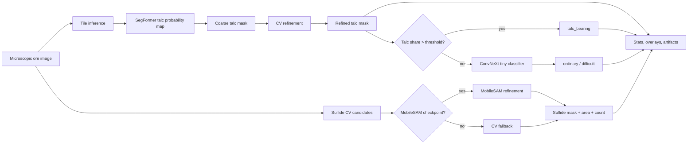

<p align="center">
  <h1 align="center">PyTorchi: Ore analyzer</h1>
  <p align="center">
    Hybrid <b>ML + Classical CV + Human-in-the-loop</b> web application for microscopic ore image analysis.
  </p>
</p>

<p align="center">
  
  
  
  
  
</p>

---

## What is it?

**PyTorchi: Ore analyzer** is a local web application that turns a microscopic ore image into interpretable analysis artifacts:

- refined talc mask;
- sulfide inclusion mask;
- talc and sulfide area statistics;
- final ore class: `talc_bearing`, `ordinary`, or `difficult`;
- confidence maps, timings, warnings, and downloadable artifacts.

The project was built around a practical constraint: **there is not much labeled data, and ore boundaries are often ambiguous**. Instead of forcing one model to solve everything end-to-end, the system combines neural models, deterministic CV rules, and expert corrections in one workflow.

<p align="center">
  <b>Model finds candidates → CV refines them → expert can inspect and correct → app recomputes only what changed.</b>
</p>

---

## Demo materials

- **Presentation:** [Nornikel-hackaton-PyTorchi-2026](https://docs.google.com/presentation/d/1Z_7QINek-iBY46WZOCvWw2UVbQT830bqoDHGWoQfMNU/edit?usp=drivesdk)
- **Demo video:** [video-PyTorchi.mov](https://drive.google.com/file/d/1KZ16eZ28_OYrYruE6W4dxinyBH5z04OW/view?usp=drivesdk)

---

## Highlights

| Area | What is implemented |
|---|---|
| **Talc segmentation** | SegFormer-based tile inference with overlap/no-overlap modes |
| **Talc refinement** | Classical CV post-processing inside the coarse mask: local darkness, LAB lightness, morphology, connected components, confidence fusion |
| **Ore classification** | ConvNeXt-tiny classifier for `ordinary` / `difficult` when talc share is below threshold |
| **Sulfides** | Fast CV mask + optional MobileSAM refinement with fallback to CV if SAM is unavailable |
| **Expert workflow** | Layer opacity controls, thresholds, manual polygon add/remove edits, selective recomputation |
| **Batch processing** | Sequential queue for many images without duplicating models in RAM |
| **Persistence** | Job history, uploaded files, artifacts, settings, cache size control, recovery after restart |
| **Deployment** | Docker Compose for CPU and GPU, health checks, mounted model directory, persistent volume |

---

## Pipeline



### Why hybrid?

With a small dataset, the most stable strategy is to use the neural network as a **candidate generator**, then make the final result more controllable with CV rules and expert feedback:

- SegFormer quickly localizes rough talc regions;
- CV removes artifacts and refines dark inclusions inside the candidate area;
- ConvNeXt handles the `ordinary` / `difficult` decision only when talc is not dominant;
- MobileSAM can refine sulfide contours, but the app remains usable without it;
- thresholds and manual edits are visible and adjustable, not hidden inside a black box.

---

## Application architecture

```mermaid
flowchart TB
    UI[React + TypeScript + Vite UI] -->|REST API| API[FastAPI backend]
    API --> Queue[JobManager sequential queue]
    Queue --> Inference[PyTorch + OpenCV inference pipeline]
    Inference --> Artifacts[Overlay masks, confidence maps, stats]
    API --> Store[Persistent jobs_data volume]
    Store --> History[History, cache, job recovery]
    API --> Health[/api/health]
```

The app is intentionally local-first: model checkpoints and user images are **not baked into the Docker image**. They are mounted from the host machine, while processed jobs are stored in a named Docker volume.

---

## Quick start

### Requirements

- Docker Desktop **4.35+** or Docker Engine **27+** with Compose v2;
- at least **8 GB RAM**, recommended **16 GB** for large images;
- model checkpoints in a local directory:
  - `talc.pt` — talc segmentation checkpoint;
  - `sulfide.pt` — ore class classifier checkpoint;
  - `mobile_sam.pt` — optional MobileSAM checkpoint for sulfide refinement.

> The application can start without checkpoints, but analysis will be unavailable until the required models are configured.

---

### macOS / Linux

```bash
sudo bash run.sh
```

The script asks for model paths and stores the selected values in `.env`, so later launches reuse the same configuration.

---

### Windows

Run as Administrator:

```powershell
.\run.bat
```

The Windows launcher delegates to `run.ps1`, performs the same setup as `run.sh`, starts Docker Compose, and offers to open the browser.

For Docker Desktop, model paths such as `C:\models` are supported. Make sure the drive is available to Docker Desktop.

---

### Manual CPU launch

```bash
cp .env.example .env
# edit MODEL_DIR and checkpoint names in .env

docker compose config --quiet
docker compose up --build -d
```

Open:

```text
http://localhost:8080
```

Check service state:

```bash
curl http://localhost:8080/health
docker compose ps
docker compose logs -f
```

Stop without deleting history:

```bash
docker compose down
```

Delete history, uploaded files, and artifacts:

```bash
docker compose down -v
```

---

### GPU launch

```bash
docker compose \
  -f docker-compose.yml \
  -f docker-compose.gpu.yml \
  up --build -d
```

The GPU override switches PyTorch wheels to CUDA and sets:

```env
MODEL_DEVICE=cuda
```

---

## Configuration

`.env.example` contains the main runtime settings:

| Variable | Meaning |
|---|---|
| `APP_HOST` | Host interface for the web app. Use `127.0.0.1` for local-only access. |
| `APP_PORT` | Public web port. Default: `8080`. |
| `MODEL_DIR` | Host directory mounted read-only into the backend container. |
| `TALC_CHECKPOINT_FILE` | Talc segmentation checkpoint filename. |
| `SULFIDE_CHECKPOINT_FILE` | Ore classifier checkpoint filename. |
| `SULFIDE_SAM_CHECKPOINT_FILE` | Optional MobileSAM checkpoint filename. |
| `MODEL_DEVICE` | `cpu` or `cuda`. |
| `SULFIDE_SAM_DEVICE` | `auto`, `cpu`, or `cuda` depending on environment. |
| `CV_NUM_THREADS` | Number of OpenCV/CV worker threads. |
| `MAX_UPLOAD_BYTES` | Per-file upload limit. |

---

## User workflow

1. Upload one image, multiple files, or an entire folder.
2. Select segmentation mode: with overlap or without overlap.
3. Inspect overlays:
   - coarse talc mask;
   - refined talc mask;
   - sulfide CV/SAM mask.
4. Tune thresholds for segmentation, CV refinement, talc share, and classification.
5. Add or remove talc regions manually using polygons.
6. Save edits and recompute derived statistics/classification without rerunning the whole pipeline.
7. Return to previous jobs from history or add more images to an existing job.

---

## API overview

The backend exposes a small REST API around jobs, artifacts, history, and cache management.

| Endpoint | Purpose |
|---|---|
| `GET /api/health` | Service and model status. |
| `POST /api/jobs` | Create a new analysis job from uploaded images. |
| `GET /api/jobs` | List recent jobs. |
| `GET /api/jobs/{job_id}` | Get job state and progress. |
| `GET /api/jobs/{job_id}/results` | Get per-image results. |
| `POST /api/jobs/{job_id}/images` | Add more images to an existing job. |
| `PATCH /api/jobs/{job_id}/settings` | Update job/image settings and queue selective recomputation. |
| `PUT /api/jobs/{job_id}/images/{image_id}/talc-edits` | Save manual talc polygon edits. |
| `DELETE /api/jobs/{job_id}/images/{image_id}/talc-edits` | Reset manual talc edits. |
| `GET /api/jobs/{job_id}/artifacts/{image_id}/{artifact_name}` | Download generated artifacts. |
| `GET /api/cache` / `PATCH /api/cache` / `DELETE /api/cache` | Inspect, resize, or clear local history/cache. |

---

## Development mode

Dev Compose mounts source code, runs Uvicorn with reload, and keeps Vite HMR enabled while preserving the same app URL:

```bash
docker compose -f docker-compose.dev.yml up --build
```

Frontend checks:

```bash
cd frontend
npm install
npm run build
npm test
```

Backend checks are available through the project-level infrastructure check:

```bash
make check
```

For a full production-like smoke test:

```bash
docker compose build
docker compose up -d
curl --fail http://localhost:8080/health
```

---

## Tech stack

| Layer | Stack |
|---|---|
| ML / CV | PyTorch, torchvision, OpenCV, NumPy, timm, segmentation-models-pytorch, MobileSAM |
| Backend | FastAPI, Uvicorn, Pydantic, Pillow, python-multipart |
| Frontend | React 18, TypeScript, Vite, lucide-react, Remotion player |
| Deployment | Docker, Docker Compose, Nginx, health checks, persistent Docker volumes |
| Testing / Quality | pytest, Vitest, Makefile checks |

---

## Project structure

```text
.
├── backend/                 # FastAPI service, schemas, storage, queue, inference pipeline
├── frontend/                # React + TypeScript interface
├── Dockerfile.backend       # Python runtime with PyTorch and CV dependencies
├── Dockerfile.frontend      # Vite build served by Nginx
├── docker-compose.yml       # Production CPU deployment
├── docker-compose.gpu.yml   # GPU override
├── docker-compose.dev.yml   # Development mode
├── .env.example             # Runtime configuration template
├── run.sh                   # Interactive macOS/Linux launcher
├── run.bat / run.ps1        # Windows launcher
└── README.md
```

---

## Current metrics snapshot

| Metric | Value |
|---|---:|
| Ore classifier validation F1 | **91%** |
| First result latency | **≈ 7 s** for the first image in the demo scenario |
| Stored history limit | configurable, **1–500** images |

The exact runtime depends on image size, hardware, checkpoint configuration, and whether MobileSAM refinement is enabled.

---

## Limitations

- Model weights are not stored in the repository or Docker image.
- Results depend on microscope acquisition conditions and domain similarity to the validation data.
- MobileSAM is optional; without its checkpoint, sulfide analysis falls back to the CV mask.
- Talc boundaries can be ambiguous, so the interface intentionally keeps thresholds and manual correction tools available to the expert.

---

## Roadmap

- improve SegFormer and classifier quality after collecting more expert labels;
- tune CV thresholds, blackhat kernels, morphology, and component filters for new domains;
- include ore metadata such as deposit, sample, shooting mode, chemistry, and process context;
- generate automatic expert reports with images, percentages, class, warnings, and explanation of the decision.

---

<p align="center">
  <b>PyTorchi: Ore analyzer</b><br />
  Less manual routine. More time for expert decisions.
</p>
