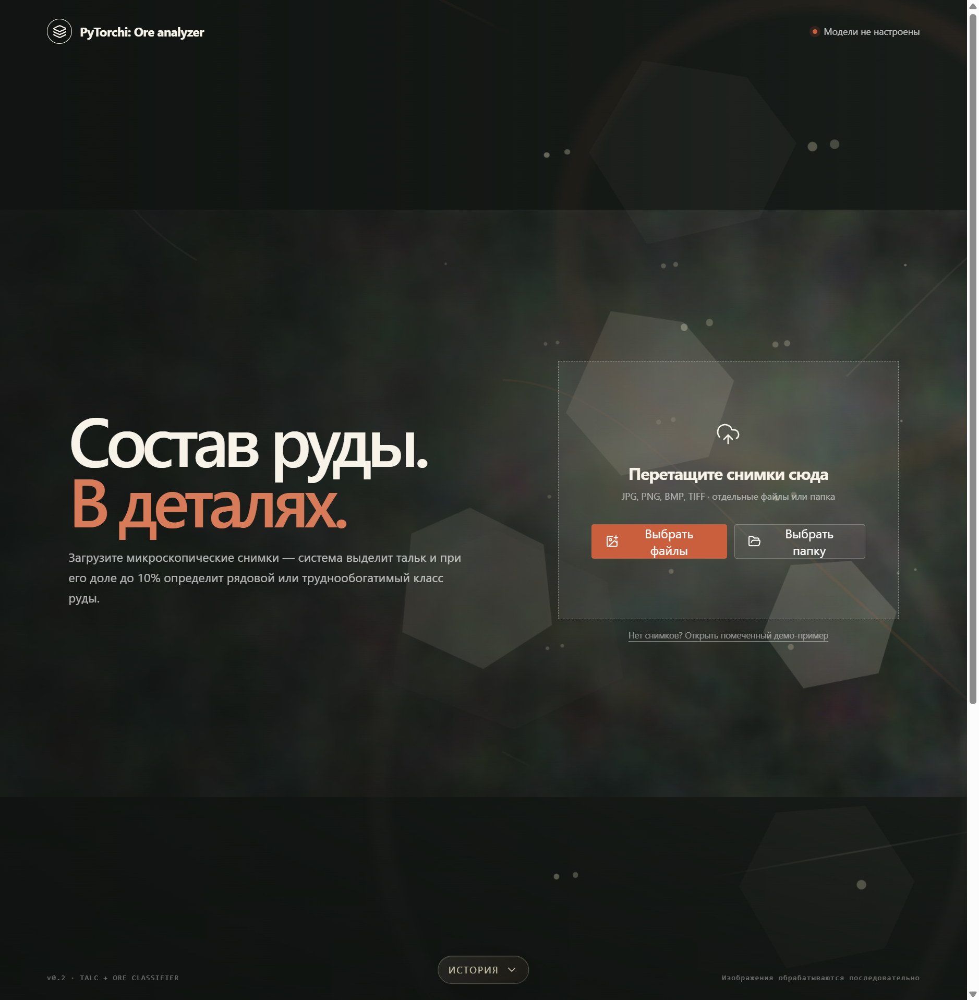
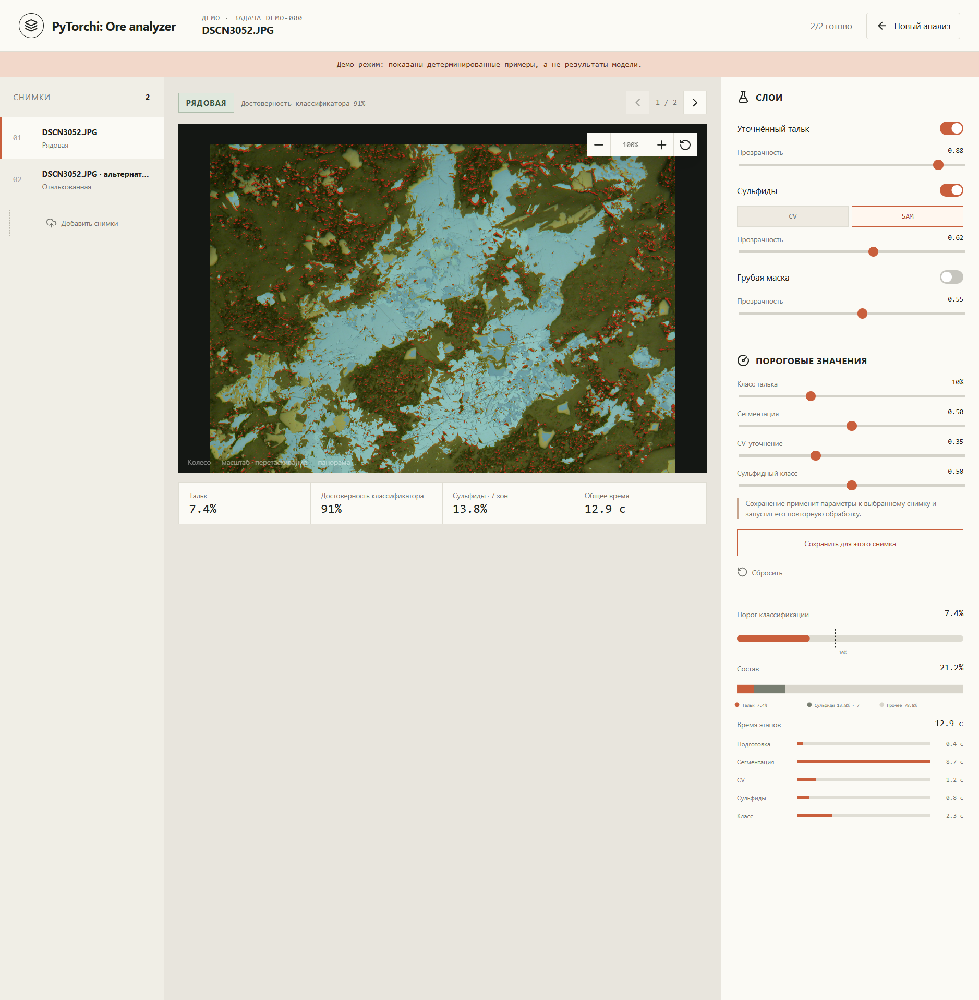

<p align="center">
  
</p>

<h1 align="center">PyTorchi: Ore analyzer</h1>

<p align="center">
  Локальное приложение для анализа микроскопических снимков руды.<br />
  Выделяет тальк и сульфиды, объясняет результат визуально и оставляет последнее слово эксперту.
</p>

<p align="center">
  
  
  
  
  
</p>

## От микроснимка — к понятному решению

PyTorchi помогает технологу быстрее разобраться в составе руды. Пользователь загружает один снимок, серию файлов или целую папку; приложение показывает доли талька и сульфидов, классифицирует руду как **рядовую**, **труднообогатимую** или **оталькованную** и сохраняет все артефакты анализа.

Это не «чёрный ящик». В интерфейсе видны исходное изображение, маски, пороги, время этапов и доверие классификатора. Контуры можно скорректировать вручную — итоговые метрики и класс пересчитаются без полного прогона модели.

## В работе

<p align="center">
  
</p>

*Рабочее место: исходный микроснимок, накладываемые маски, результат классификации, доли минералов и параметры обработки.*

## Что получает эксперт

- **Тальк:** грубая и уточнённая маски, процент площади и уверенность результата.
- **Сульфиды:** быстрый CV-контур и, при наличии весов, уточнение через MobileSAM.
- **Класс руды:** при доле талька до 10% ConvNeXt различает рядовую и труднообогатимую руду; при большей доле образец помечается как оталькованный.
- **Контроль:** прозрачность слоёв, пороги, ручное добавление и исключение областей полигоном.
- **История:** задачи, загруженные файлы и артефакты переживают перезапуск сервиса.

## Почему гибридный подход

Нейросеть хорошо находит кандидатов на минералы, но границы на микроснимках часто неоднозначны, а размеченных данных немного. Поэтому PyTorchi объединяет несколько сильных сторон:

- **SegFormer** строит вероятностную карту талька на крупных изображениях по тайлам;
- **OpenCV** уточняет маску локальными признаками, морфологией и связными компонентами;
- **ConvNeXt-tiny** принимает решение о классе руды в нужном диапазоне доли талька;
- **MobileSAM** может аккуратнее обвести сульфидные включения, но система сохраняет работоспособность и без него;
- **эксперт** видит каждый шаг и правит только спорные участки.

Так автоматизация ускоряет рутинную часть, не пряча логику решения.

## Стек

| Задача | Технологии |
| --- | --- |
| Модели и обработка изображений | PyTorch, SegFormer, ConvNeXt, MobileSAM, OpenCV, NumPy |
| API и фоновые задачи | FastAPI, Pydantic, Uvicorn |
| Интерфейс | React, TypeScript, Vite |
| Развёртывание | Docker Compose, Nginx, persistent volumes |

## Запуск

Нужен Docker Desktop (или Docker Engine с Compose v2) и папка с весами моделей. Скопируйте настройки и укажите путь к весам:

```bash
cp .env.example .env
# в .env задайте MODEL_DIR и имена talc.pt / sulfide.pt
docker compose up --build -d
```

После запуска откройте [http://localhost:8080](http://localhost:8080). На Windows можно запустить `run.bat`, на macOS/Linux — `sudo bash run.sh`: скрипты помогут заполнить `.env`.

`mobile_sam.pt` необязателен: без него анализ сульфидов использует CV-маску. Веса и пользовательские изображения не попадают в Docker-образ и не хранятся в репозитории.

## Материалы

- [Презентация проекта](https://docs.google.com/presentation/d/1Z_7QINek-iBY46WZOCvWw2UVbQT830bqoDHGWoQfMNU/edit?usp=drivesdk)
- [Демо-видео](https://drive.google.com/file/d/1KZ16eZ28_OYrYruE6W4dxinyBH5z04OW/view?usp=drivesdk)

---

<p align="center"><i>Меньше ручной рутины. Больше времени на экспертное решение.</i></p>
